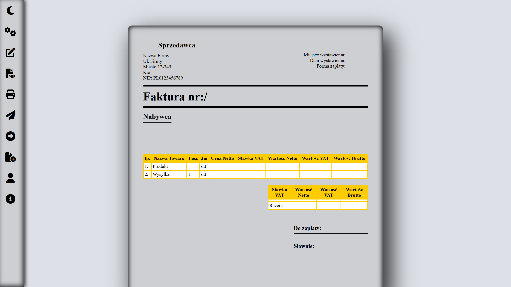
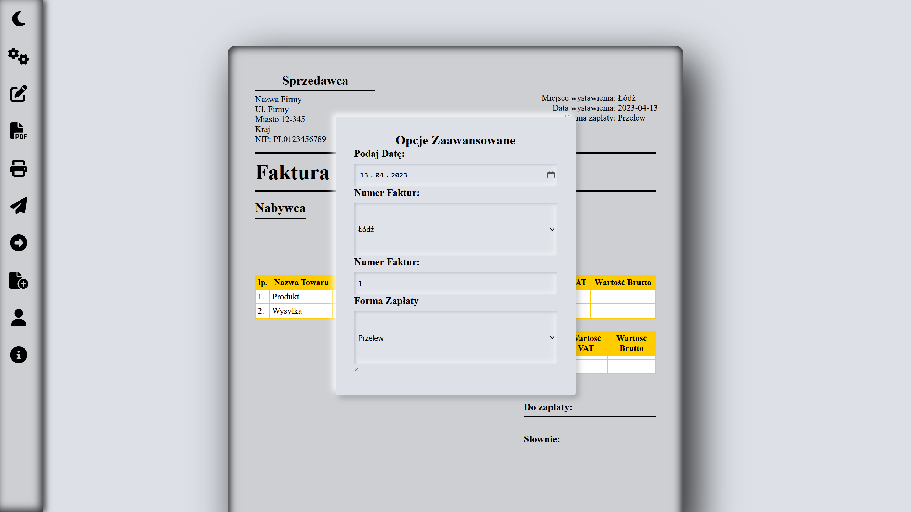
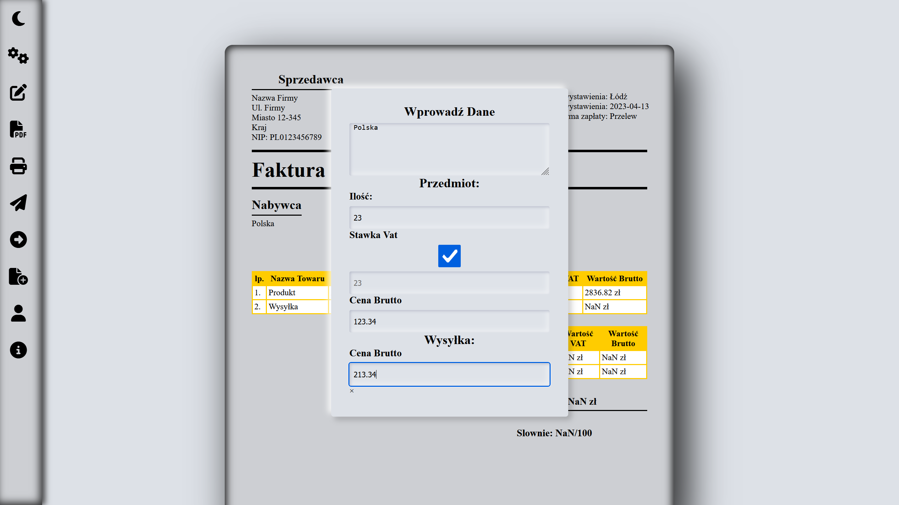
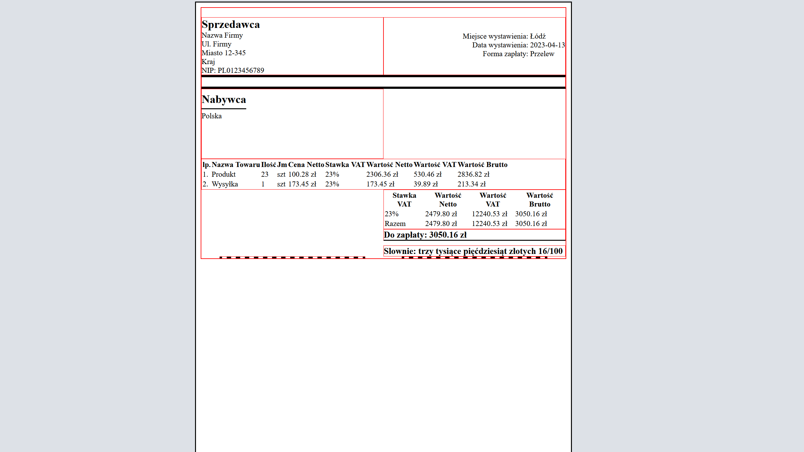

# Aplikacja-faktury

### Projekt nie ukończony

#### [Link do strony: ](https://luki23445.github.io/Aplikacja-faktury/)

### Języki: HTML, CSS, JavaScript.

## Aplikacja ma na celu pomoc w szybkim wystawianiu faktur.

## Aby wystawić fakturę trzeba w pierwszj kolejności wejść w opcje zaawansowane i ustawić datę. Następnie otworzyć zakładkę "wprowadź dane" gdzie trzeba podać kwoty, ilość oraz dane odbiorcy przy czym kiedy w danych odbiorcy będzie podany kraj wtedy stawka vat przypisze się sama. Na końcu możemy otworzyć menu kontekstowe i wydrukować fakturę.

